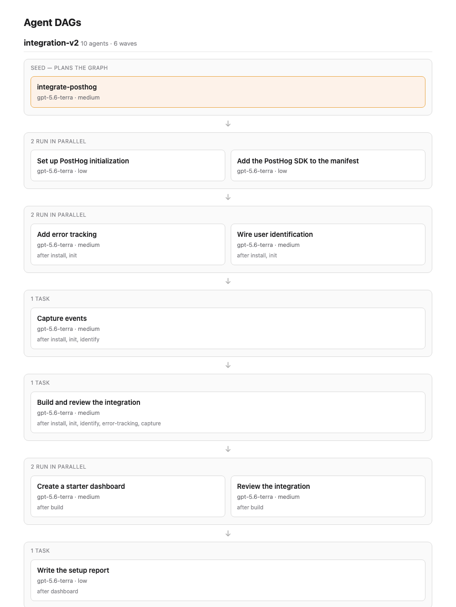

# Request for comments: Wizard v2.5

## Problem statement

What is the ideal shape for a Wizard shape today? 

What is an ideal shape for the Wizard in Q4 2026?

It's certainly not the same as it was in 2024/2025. The assumptions and limitations that shaped the Wizard today is _not_ applicable anymore.

I'm here to challenge our assumptions, propose some changes today, and prospect about the future shape of the Wizard.

In **this RFC**, I will discuss the things I believe we should ship immediately.

In [Wizard v3](./2026-07-24-wizard-v3.md), I will make some forward looking suggestions.

## The old assumption

Skip to [what we're gonna fix now](#what-were-gonna-fix-now-wizard-v25) to see what we're changing without a history lesson lol.

The benchmark to beat in 2025 was an engineer reading our docs and trying to setup PostHog for Product Analytics themselves. The 2025 goal was simple: _get as many ingested, identified events into PostHog as possible_. 

This is outdated in several ways:
- Product Analytics is no longer the default assumed entry point
- We're pushing to get people on to self-driving
- The Wizard is needed in Cloud runs as a standalone agent, decouple from the TUI
- The quality bar of an install has changed. Users (that are our ICP) are agent pilled and have Opus 5.

The target has shifted. We can't keep shooting the same shot and hope it'll land.

## Some historical context

The limitations that shaped the Wizard V2 are also no longer relevant. 

Models were weak, they were expensive, most people weren't agent pilled. In fact, "Agent" was an ill defined and controversial term.

### The old goal post

We wanted the Wizard to feel like a traditional "installation wizard" with extra magic.

The Wizard V2 did precisely these things:
- Detect what framework the user was using
- Pull docs, skills, packaged examples and context.
- Plan ~15 events to collect from the user's project
- Install the SDK
- Initialize the SDK and pull down relevant environment variables
- Enable auto-capture, error tracking, and session replays
- Instrument 15 capture call sites
- Create 5 insights and a dashboard.
- Hand off with a markdown report for humans and robots alike.
- Taught people about PostHog through our slides show
- Brought joy with things like a Hackernews tab

This was great for its time.

The PR made sense for our goals, the PR was small enough to test, it got people off a blank page.

In 2025, most people were **integrating PostHog by hand** still. The Wizard will beat that every time, hands down.

But _most_ developers are armed with GPT 5.6 and Opus 5 class models today. There is honestly a less clear advantage to using the Wizard in its current form.

### The old limitations

We also needed the Wizard to be cheap, relatively fast, and reliable. When all we had to lean on were Opus 4.5 and Sonnet 4.5, a linear agent with heavy scope restrictions was all that we could do. This was also with 200K context.

- These models failed miserably without specific guidance to integrate PostHog
- They could not reason about the complexities of SSR, Next App vs Page router, React Native vs React, so on.
- We could not run them fast and cheap enough to add interactivity
- We could not guarantee the integration quality without hand holding the robot.
- Oh, monorepos were much less feasible
- We could not practically introduce interactivity, especially not cheaply, safely and reliably.

The most prominent pieces of feedback we get are "make the wizard support monorepo" and "make the setup customizable". We've wanted to do these things, they were not practical until very recently.

### What recent models unlock

With newer models, especially the GPT 5.6 class models, all of these practical limitations are gone.

We can run the Wizard V2 shape for 1/3 the cost and 1/2 the time.

Actual numbers from a live flagged experiment, on production sized apps: 

| step | pi p50 | anthropic p50 |
| --- | --- | --- |
| seed | 0:21 | 0:43 |
| init | 0:42 | 2:43 |
| install | 0:22 | 0:29 |
| capture | 1:14 | 5:25 |
| identify | 0:46 | 2:21 |
| error-tracking | 0:22 | 1:29 |
| build | 0:54 | 2:11 |
| review | 1:55 | 4:49 |
| dashboard | 0:27 | 1:23 |
| report | 0:41 | 3:28 |
| total (median run) | 7:58 (n=511) | 26:01 (n=85) |

What would have taken us 26 minutes to run now takes less than 8 and costs ~$2.

I believe that it's time for a big rethink. The assumptions and limitations under which the Wizard V2 was built no longer hold. It's time to throw away the set of skills and tasks that were designed under a different set of assumptions and limitations.

It is now practical to build a multi-agent wizard setup with newer models. It _can_ do the same old Wizard V2 task just fine. In fact it beats the old Wizard in [7/11 open source apps](https://github.com/PostHog/context-mill/pull/245#issuecomment-5024035756) we benchmarked. But _**should it still do these same old things?**_

## What we're gonna fix now (Wizard v2.5)

What we should ship now can be broken down into a few parts:

### 1. Rebuild the context mill

The context mill is shaped around the old agents we needed to hand hold. New models are excellent at understanding more freeform context when given a goal. New models can also be broken down into smaller agents and tasks that can be composed together to achieve a goal.

What this means for the context mill:
- Move "agent prompting" like defining goals back into the Wizard. We tight coupled what to do and how to do because the old models needed to be hand held.
- Context mill becomes thin again. It should mostly reference docs and package it into  appropriate little bundles for distinct tasks. This is with some limited information like "examples" for agents, commandments (pitfalls for agents not humans).
- Ship docs updates to fit the context mill's needs, not use the context mill to monkey patch bad docs. Those docs are also mostly read by agents anyway.

### 2. Cut back what the default Wizard command does

I think getting started on PostHog today means different things. Autocapture by default and some basic handoff instructions to someone's agent is enough. Getting **merged into a codebase** + install MCP matters more, because their agents will automatically begin exploring PostHog.

The flow should be **broader**, faster, to cover more products yet **shallower** because the user's agents are much better at using the PostHog MCP to manipulate simple dashboards and insights.

The wizard should do this by default:

   - Install the SDK
   - Initialize and apply environment variables
   - Instrument basic identify
   - Instrument the base products: Product Analytics, Web Analytics, Session Replay, and Error Tracking (critical to self-drive)
   - Ask about relevant products like AIO, Logs, warehouse sources, MCP analytics. 
   - Write a handoff report for their agent locally, handoff to a handbook in PostHog
     - Suggest captures, funnels, dashboards, insights, etc.
     - Leave behind context for the agent to use the PostHog MCP
     - Suggest data sources to connect
     - Leave commands + links to skills to do things like add new data sources, upload source maps, etc.
     
**Key removals**: 15 capture sites, dashboards, insights. This isn't relevant, leave the tools for their agents to drive these. We want a easier PR to review and faster merge.

### 3. Split the agent from the TUI

We can't bet on the CLI TUI as the best way to integrate PostHog. I still prefer it, the sense of control and ease of use is appealing. But in the future, probably a Cloud run or a PostHog Desktop app. 

A real web-ui is much better for many tasks we try to do today, like introduce insights and dashboards, or setting up external signal sources.

The agent loop is the bit that does all the cool integration work, calling MCPs, scheduling tasks, downloading skills. 

It should be decoupled from the TUI so that the agent can run headless and be controlled by a separate process. It also lets Cloud runs defer actions we'd normally take through the MCP in the TUI to a proper web interface.

We're ready for this for several reasons:
- The TUI is entirely state driven through a single store. If we removed the TUI and put in a 2 way socket connection or any other protocol, we can control the agent from a separate process.
- We have the switchboard now to cleanly decide which sequence, agent harness, model, effort to use. This gives us incredible ability to split out the agent from the TUI.
- The Wizard-CI MCP server already does this. PostHog Code can drive the agent with it to take snapshots and test on my behalf.

### 4. Force MCP install on the outro and cut out the rest

It's Q3 2026 and we're self-driving. Of course they need the MCP. I'm convinced we should ask about Slack and show the tutorial elsewhere.

### 5. Only handoff screen is: "Do you want self-driving?"

The self-driving program needs some help. We're working on improving scouts, docs about scouts, custom scouts, etc. We can use this change to teach about self-driving AND suggest scouts presented in a nicer way.

- Do you want to self-drive? Explain what it is, reuse pocket book content
- On yes, we run that program immediately
- On Cloud run -> They could be taken to a web UI first experience
- We can teach them what this means with a show. We're good at shows.

### 6. Handle monorepos

- `22.2%` of runs are monorepos and we drop them on the floor today
- Detect every project, not the first front-end-client-side-shaped one
- Show the list and let the user pick which ones to instrument. This is the one question the V2.5 Wizard asks.
- Build a DAG over what they picked, and run it:
  - Root level work is serialized. The lockfile is one file, the root config is one file, and N agents racing on them is how you hand someone a broken repo.
  - Shared packages land before the apps that consume them.
  - The server SDK and the client SDK have to agree on identity, so they get planned together, not separately.
  - Everything genuinely independent runs in parallel, because otherwise a 4 project monorepo takes 4x as long and we blow the 3-5 minute target.
- One report covering all of them
- The only thing we know up front is the project API key and host. Everything else about the shape of the repo is discovered.

## What we'll fix in the future (Wizard V3)

Everything else lives in the [Wizard v3 RFC](./2026-07-24-wizard-v3.md):

0. Composable microskills — the substrate everything else sits on
1. Self-driving first experience
2. Customizable, modular setup
3. Our edge is not the model (defer to the user's agent, thumb on the scale)
4. Higher instrumentation quality
